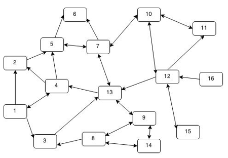
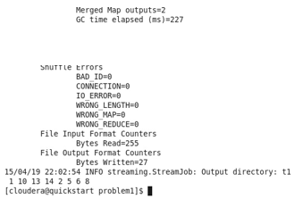
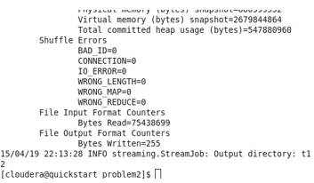
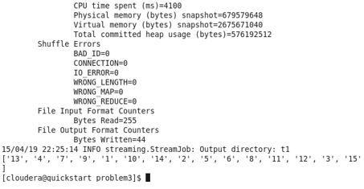
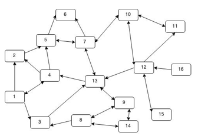
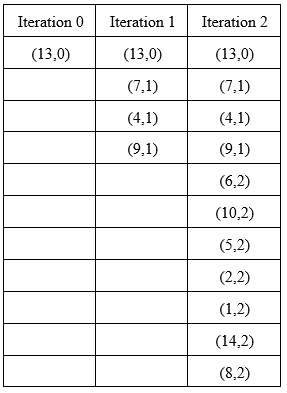

# graphic-theoretic-problems

Graphs are mathematical structures used to model pair-wise relations between objects from a certain collection. Graph can be defined a set V of vertices and set of edges. Where, V is collection of |V| = n abstract data types. These abstract data types are also called nodes. 

In computer science, graphs are used to represent networks of communication, data organization, computational devices, the flow of computation, etc. For instance, the link structure of a website can be represented by a directed graph, in which the vertices represent web pages and directed edges represent links from one page to another. 

MapReduce is a framework for processing parallelizable problems across huge datasets using a large number of computers (nodes), collectively referred to as a cluster or a grid. MapReduce is useful in a wide range of applications, including distributed pattern-based searching, distributed sorting, web link-graph reversal, Singular Value Decomposition, web access log stats, inverted index construction, document clustering, machine learning, and statistical machine translation.

Using mapreduce method to solve graph problem is a tempting idea. Because nowadays, data is increasing in size every day, traditional ways of data analysis will finally be out-of-date. Taking the advantage of parallel computing is an inevitable trend. In this project, we tried to solve several graph problems by writing a program using Hadoop streaming.

## problem 1

1)	Given a node N, find all nodes exactly K hops away. Put another way, starting at a domain, find all web pages one can reach in 3 clicks.

## problem 2

2)	For a given pair of nodes X and Y, find the shortest distance from X to Y where distance is defined as the number of links to get from X to Y in a directed graph.

## problem 3

3)	For a node X, find the transitive closure of X (that is, the set of all nodes reachable from X).

## setting 

This project used a 16-node graph we created to test and demonstrate programs and algorithm. A google web graph from Google programming contest was also used to test and analysis programs. Since this is just an elementary exploration, we used a relatively simple model, unweighted directed graph. The graph given as a table with two columns, the first column is the ID of the start node while the second column is the ID of the target point. For example:

#

## design

The idea behinds three problems is the same, that is: start from a given point search its neighbor nodes, goes one step further every time until reach the terminate condition. Iterations is the same for every problem: search target nodes of start points in the graph (a table of pairs of vertexes) and use IDs of target nodes as the start points of the next iteration.

##

For problem 1: assume we need to find nodes that are 2 hops away from 13. Perform iterations until iteration time is equal to the 2. After iterations, the current target points are the nodes that are k hops away from 13.

#

##

For problem 2: assume we need to find the shortest distance from 13 to 2. Using 13 as the initial start point and perform iterations until node 2 is found as a target node. At this point, the iteration times is the distance from 13 to 2.

#

##

For problem 3: assume we start from 13, and record the ID of node that has been visited. When there is no new ID being record, terminate the iteration. The nodes recorded at this point is the transitive closure of 13.

#

##

In a word, all these three problems could be solved using breadth-first search. The different between a normal BFS and a BFS with Map/Reduce is that in a normal BFS, the program goes through neighbor nodes one by one while Map/Reduce goes through every neighbor nodes in a single run. 

#

## implementation

Several different implementations were tried, and the final practical design contains the following components:
-	Mapper: take one or more arguments as the ID of starting points, goes through the graph to find targets nodes of starting points. Once find a target nodes, map its ID.
-	Reducer: remove duplicated ID and output incoming IDs.
-	Driver: the driver program manages iterations. It extracts the result from reducer and feed the result to mapper as the arguments for the next iteration. When the terminate condition is fulfilled, the driver ends the program and output the result.

The processes are as follow:
-	First iteration:
   Driver calls mapper using a pre-defined node ID (the original start point) as an argument. Mapper sends IDs of target nodes of the original start point out. The reducer discard duplicated IDs and output the rest of them to a file (a bunch of IDs).

-	Iterations after the first one:
Driver fetch the content of output file from reducer and delete the file, then calls mapper using the content from output file as arguments (a bunch of IDs). Mapper takes arguments as start points, and map their target nodes. The reducer discard duplicated IDs and output the rest to a file (a bunch of IDs).
Repeat until the terminate condition is fulfilled.

## sample runs and performance

The running time is relatively long as our expected, since we ran the program on a single node and a small dataset. A single map/reduce operation may take two minutes. We also tried google web graph, a relatively larger dataset, it turned out that we cannot solved problems in a reasonable time for the most of times.

#

##

Listing below are three sample runs on the graph above:

#

-	Sample run for problem 1: find nodes exactly 2 hops away from 13.

#

-	Sample run for problem 2: find shortest distance from 13 to 2.

#

-	Sample run for problem 3: find transitive closure of 13

## consideration and problem encountered

Our original design is different from our final implementation. There were some problems forced us to modify our original design. The original design is as follows:

Assume we need find nodes that is K hops away from node 13. Initial a distance table T with a pair (current start node, distance to the original point), (13, 0) in this case, which means 13 is 0 hop to itself.

For iteration N (N starts from 1):
1.	Map everything in T
2.	For nodes in T, if a node (A, count) is N-1 hops away from the original point (count equals to N - 1), find its neighbor nodes C, map every node in C and increase count by one, e.g. map(C1, count + 1), map(C2, count + 2)…
3.	Reducer receives sorted pairs. If there are multiple pairs has the same ‘current start node’, choose the smallest one and discard others. This step prevent the search ‘turning back’.

#

A sample run on graph above mapping pairs as following:

#

There are two major issues with this design:

1.	Hadoop streaming doesn’t support workflow management and job chaining, we must write a driver program to control the iterations. If we decided to use a driver program, there is no point to map the distance from the original start point; the number of iteration is the distance and it could be recorded by driver program.
2.	In this design, mapper search neighbor nodes in graph. A graph in this project is a 2* N table lists all pairs of vertexes. In real life, the graph table could be extreme large that cannot fit in a single machine. Therefore, search a graph which is stored in local machine is not applicable.

Therefore, we have a driver program in our final design and map only the target node. Besides, after modifying the whole mapping process itself could be seen as a searching in a graph which is distributed among many machines.

## conclusion

In this project, we provide a straightforward solution to graph problems with Hadoop map/reduce. With problems encountered, our design of the program has been modified several times. Based on these problems, it could be concluded that:

1.	Hadoop streaming is not a good way to solve graph problem, since it doesn’t provide good support for user to manage workflow and chaining jobs. Iteration is commonly used in solving graph problems, but Hadoop streaming is not iteration-friendly enough.

2.	There are solutions for solving graph problems using Hadoop streaming, but their efficiency is not satisfying if working on insufficient nodes and small dataset.

However, it is still worth to try frameworks other than Hadoop streaming to solve graph problems. Hadoop streaming itself also has rooms for improving. At least, one could build a lager cluster to obtain a faster speed. 
